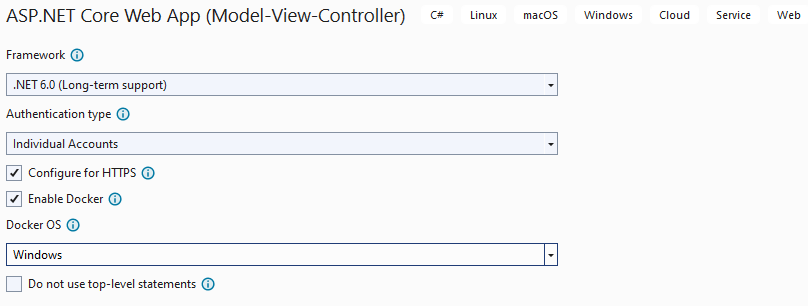
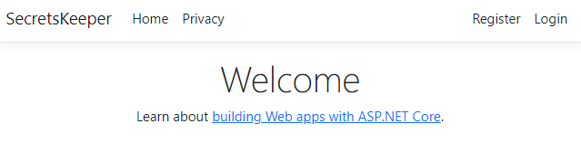
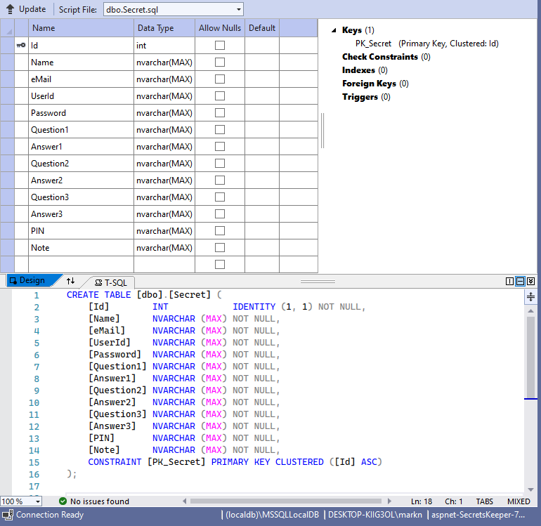
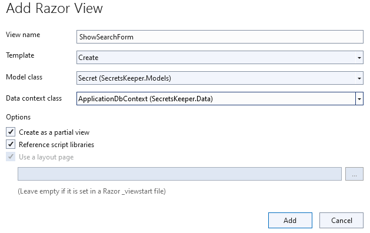
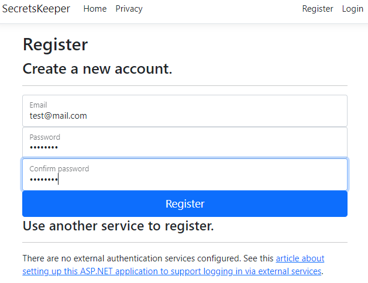
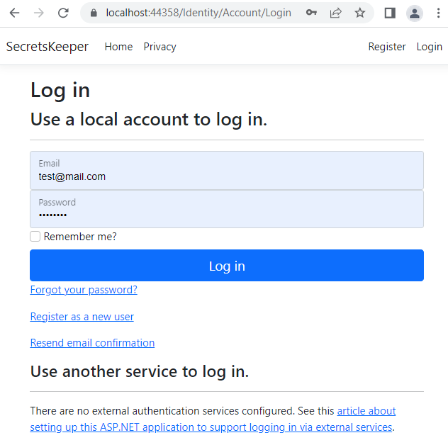
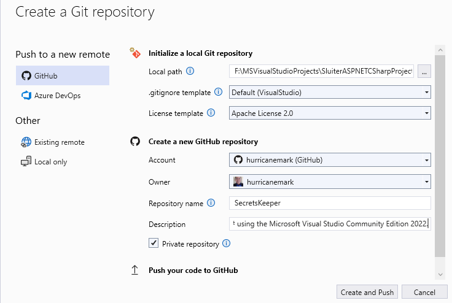

# Project name: Secrets Keeper -- An ASP.NET Core MVC WebApp

This is a full-stack MVS web application in C#HTML (Razor) in the Microsoft Visual Studio 2020 IDE Community Edition and .NET 6.


## What is ASP.NET Core?

* Microsoft C# tool to build web applications
* Comparable to Java Spring, PHP Lavarel, Python Flask, and Node.js Express
* .NET -> Microsoft's Software Development Platform similar to Java Virtual Machine consists of runtime engine and libraries for executing programs written in a compliant language.  .NET is language neutral that supports more than 20 languages that include: C#, C++, VB, Java/J++, Ruby, Python,...

* ASP -> Active Server Page: Dynamic web pages, usually connected to a database.  It replaced the Classic ASP technology.
* Core -> open source, cross-platform version of ASP.

Together, ASP.NET Core is Full Stack having (database, business logic, HTML)

An ASP.NET page is web page that contains a mix of HTML markup and dynamic ASP markup.  An ASP.NET is run on the server, combining the static HTML code, and updating the dynamic ASP elements to produce a final HTML page.

<br />


### Create a new project



Initial project MVC scaffolding should be compilable and runable.

* Select `IIS` and `run`


* The initial bootstrap looks and feel:



<br />
<hr>

## The _MVC_ Design Pattern

The __M__ odel __V__ iew __C__ ontroller helps to enforce separation of concerns; avoiding mixing presentation logic, business logic, and data access logic.

### *`Model`* manages the behaviour and data
* Data related
* Consists of classes / objects with properties
* Uses SQL statements
* Supplies the controller with lists of objects

### *`View`* manages the display of data

* HTML CSS code (or similar)
* Usually gets a list of data from the controller.
* Dynamically combines data with HTML in a template
* Razor (ASP.net) - a combination of HTML and script

##### Step to create a view

1. Right click on `Views` folder and select `Add` -> `Class..`
1. Inside the ```public class Secret { }```, type `prop` and tab twice.
1. Type `ctor` and tab twice to generate code for empty constructor.

```javascript
    public class Secret {
        public int Id { get; set; }
        public string Name { get; set; }
        public string eMail { get; set; }
        public string UserId { get; set; }
        public string Password { get; set; }
        public string Question1 { get; set; }
        public string Answer1 { get; set; }
        public string Question2 { get; set; }
        public string Answer2 { get; set; }
        public string Question3 { get; set; }
        public string Answer3 { get; set; }
        public string PIN { get; set; }
        public string Note { get; set; }
        public DateOnly CreationDate { get; set; }

        // constructor
        public Secret()
        {

        }
    }
```

<br />

### *`Controller`* handles page events and navigation between pages

##### Steps to automate dynamic pages using the IDE tools:
1. Right click on the `Controllers` folder and select `Add` -> `Controller`. 
1. Select `MVC controller with views, using Entity Framework`.  Click `Add`.
1. Select Model class: `Secret (SecretsKeeper.Models)`  and add new data context type: `SecretsKeeper.Data.ApplicationDbContext`
1. Finally, click `Add`.  A lot of autogenerated code will appear under the `Controller` and `View` folders, and a new folder `Views` -> `Secrets`.
1. The folder `View` -> `Secrets` contains files { Create.cshtml, Delete.cshtml, Details.cshtml, Edit.cshtml, Index.cshtml  }.

__Console output:__

```javascript
Finding the generator 'controller'...
Running the generator 'controller'...
Minimal hosting scenario!
Attempting to compile the application in memory with the modified DbContext.
Attempting to figure out the EntityFramework metadata for the model and DbContext: 'Secret'
info: Microsoft.EntityFrameworkCore.Infrastructure[10403]
      Entity Framework Core 6.0.15 initialized 'ApplicationDbContext' using provider 'Microsoft.EntityFrameworkCore.SqlServer:6.0.15' with options: None
Added Controller : '\Controllers\SecretsController.cs'.
Added View : \Views\Secrets\Create.cshtml
Added View : \Views\Secrets\Edit.cshtml
Added View : \Views\Secrets\Details.cshtml
Added View : \Views\Secrets\Delete.cshtml
Added View : \Views\Secrets\Index.cshtml

```

<br />
 
### Create & configure the database

Traditionally, there are at least two ways to create database, DAO and ORM.

1. __Data Access Object (DAO)__
* Manually create tables
* Traditional method of database access.
* Write your own SQL statements.
* Database managers (DBA's) usually prefer DAOs which allows greater visibility on finding problems.

2. __Object Relational Mapper (ORM)__
* Allow the computer to generate database tables based on classes defined in the application.
* Programmers prefer this method of writting SQL statements without writing SQL statements.
* Database is updated using migrations.
* e.g. Entity Framework is Microsoft's ORM.  It is simple for basic applications but not recommended for complex multi-tier application.  For that, we recommend using DAO. 

We will use the ORM method `migrate` to map views logic (a class) to the database table(s).

1. Select `Tools` -> `NuGet Package Manager` -> `Package Manager Console`
 


2. In the console with prompt `PM>`, type __add-migration "initialsetup"__ and enter.

3. type __update-database__ then enter.

__Console output:__

```javascript
...

Applying migration '20230512011820_initialsetup'.
Microsoft.EntityFrameworkCore.Migrations[20402]
      Applying migration '20230512011820_initialsetup'.
Microsoft.EntityFrameworkCore.Database.Command[20101]
      Executed DbCommand (2ms) [Parameters=[], CommandType='Text', CommandTimeout='30']
      CREATE TABLE [Secret] (
          [Id] int NOT NULL IDENTITY,
          [Name] nvarchar(max) NOT NULL,
          [eMail] nvarchar(max) NOT NULL,
          [UserId] nvarchar(max) NOT NULL,
          [Password] nvarchar(max) NOT NULL,
          [Question1] nvarchar(max) NOT NULL,
          [Answer1] nvarchar(max) NOT NULL,
          [Question2] nvarchar(max) NOT NULL,
          [Answer2] nvarchar(max) NOT NULL,
          [Question3] nvarchar(max) NOT NULL,
          [Answer3] nvarchar(max) NOT NULL,
          [PIN] nvarchar(max) NOT NULL,
          [Note] nvarchar(max) NOT NULL,
          [CreationDate] datetime2 NOT NULL,
          CONSTRAINT [PK_Secret] PRIMARY KEY ([Id])
      );
Microsoft.EntityFrameworkCore.Database.Command[20101]
      Executed DbCommand (0ms) [Parameters=[], CommandType='Text', CommandTimeout='30']
      INSERT INTO [__EFMigrationsHistory] ([MigrationId], [ProductVersion])
      VALUES (N'20230512011820_initialsetup', N'6.0.15');
Done.
PM>
```

#### Verify database creation

* From the IDE nav panel, select `View` -> `SQL Server Object Explorer`
 
 

#### Add routes to the NavBar

1. Open file `View` -> `Shared` - `_Layout.cshtml`

1. Insert new `<li>` element in the between the <ul class="navbar-nav flex-grow-1"> element as follow

```javascript
<ul class="navbar-nav flex-grow-1">
    ...

        <li class="nav-item">
            <a class="nav-link text-dark" asp-area="" asp-controller="Secrets" asp-action="Index">Secrets</a>
        </li>
        <li class="nav-item">
            <a class="nav-link text-dark" asp-area="" asp-controller="Secrets" asp-action="ShowSearchForm">Search</a>
        </li>
</ul>
```

3. Code the action `ShowSearchForm` in file `Controllers` -> 'SecretController.cs'

```javascript
        // GET: Secrets/ShowSearchForm
        public async Task<IActionResult> ShowSearchForm()
        {
            return _context.Secret != null ?
                        View() :
                        Problem("Entity set 'ApplicationDbContext.Secret'  is null.");
        }
```

4. Create a search form:  From the code above, right-click on 'ShowSearchForm()' and select `Add View...` with the following settings:



* File `Views` -> `Secrets` - 'ShowSearchForm.cshtml' should be generated.

Replace its content with the following:

```javascript
<h4>Search for Secret</h4>
<hr />
<div class="row">
    <div class="col-md-4">
        <form asp-action="ShowSearchResults">
            <div class="form-group">
                <label for="SearchPhrase" class="control-label"></label>
                <input name="SearchPhrase" class="form-control" />
            </div>
            
            <div class="form-group">
                <input type="submit" value="Search" class="btn btn-primary" />
            </div>
        </form>
    </div>
</div>

<div>
    <a asp-action="Index">Back to List</a>
</div>

```


5. Code logic for action `ShowSearchResults` in file `Controllers` -> 'SecretsController.cs`:

Insert this code snippet:

```javascript
        // POST: Secrets/ShowSearchResults
        public async Task<IActionResult> ShowSearchResults(String SearchPhrase)
        {
            return View("Index", await _context.Secret.Where(j => j.Name.Contains(SearchPhrase)).ToListAsync());
        }
```

<br />

With the database connected, and new routes added to the NavBar, features such as `Register` and `Login` should be functional at this time.  Let's test.



* Login should work, and as long as it is, the user profile should too.




At this point, we have a fully functional web site.

#### Display limited fields for "Index"

1. Limit the display of "Index" to relevent <li> elements and dislpay full table only when clicked on "Detail".
Edit file `Views` -> `Secrets` - "Index.cshtml" and make sure the table tag contains the following:

```javascript
<table class="table">
    <thead>
        <tr>
            <th>
                @Html.DisplayNameFor(model => model.Name)
            </th>
            <th>
                @Html.DisplayNameFor(model => model.eMail)
            </th>
            <th>
                @Html.DisplayNameFor(model => model.UserId)
            </th>
            <th>
                @Html.DisplayNameFor(model => model.Note)
            </th>
            <th></th>
        </tr>
    </thead>
    <tbody>
@foreach (var item in Model) {
        <tr>
            <td>
                @Html.DisplayFor(modelItem => item.Name)
            </td>
            <td>
                @Html.DisplayFor(modelItem => item.eMail)
            </td>
            <td>
                @Html.DisplayFor(modelItem => item.UserId)
            </td>
            <td>
                @Html.DisplayFor(modelItem => item.Note)
            </td>
            <td>
                <a asp-action="Edit" asp-route-id="@item.Id">Edit</a> |
                <a asp-action="Details" asp-route-id="@item.Id">Details</a> |
                <a asp-action="Delete" asp-route-id="@item.Id">Delete</a>
            </td>
        </tr>
}
    </tbody>
</table>
```

##### Enable 'Authorization' on SecretsController.

This enables register/login action before CRUD operations are allowed.

1.  Insert [Authorize] decorration on top of each method in file `Controlers` -> "SecretsController.cs".


### Push codebase to GIT Revision Control

1. Select `Git` -> `Create Git Repository..`



### Deployment

From the MS Visual Studio 2022, you can decide to deploy your web application on premise or on the cloud.  On premise, is with IIS Express or WSL.  On the cloud is with docker images.

Containerize the ASP.NET Core application and SQL Server with Docker deserves a more detailed section.  We will attempt to focus on the essentials to enable this specific deployment.  In general, steps we take here are applicable to most use cases involving containerizign ASP.NET Core application and SQL Server with Docker.

* Go back and determine if you're dockerize for Linux or Windows.  This will determine which base image to use.
* 

1.  Select `Build` -> `Publish SecretsKeeper`


## Conclusion

Creating a functional ASP.NET MVS web application only takes from 20 - 30 minutes using the Microsoft Visual Studio.
There are two components: the secretkeeper app and the SQL server database.  We will use docker-compose to build and link the two docker images together.

1. `Dockerfile` has already been automatically generated by the build
1. Modify the database connection string to cloud based SQL server container.
Open file `appsettings.json` and insert a key-pair as follow:

```javascript
  "ConnectionStrings": {
    "LocalDbConnection": "Server=(localdb)\\mssqllocaldb;Database=aspnet-SecretsKeeper-77930FB0-1012-4D21-9D41-DE704768C820;Trusted_Connection=True;MultipleActiveResultSets=true",
    "DefaultConnection": "Server=sql_server2022;Database=aspnet-SecretsKeeper-77930FB0-1012-4D21-9D41-DE704768C820;User Id=SA;Password=hcinyoV326-:)WestOfOctober;MultipleActiveResultSets=true"
  },
```

3. Add file `docker-compose.yml` to the root of the project space with the following content:

```javascript
version: '3.4'

services:
  secretskeeper:
    image: ${DOCKER_REGISTRY-}secretskeeper
    build:
      context: . # build the Docker image 
      dockerfile: Dockerfile
  sql:
    image: "mcr.microsoft.com/mssql/server:2022-latest"
    container_name: sql_server2022
    ports: # not actually needed, because the two services are on the same network.
      - "1433:1433" 
    environment:
      - ACCEPT_EULA=y
      - SA_PASSWORD=hcinyoV326-:)WestOfOctober
```

You will notice that the tool menu is now allowing option to build with `docker-compose` command.

4.  Select `Build` -> `Rebuild solution`.
 
 __Console build output__

 ```Shell
 1>Done building project "SecretsKeeper.csproj".
2>------ Rebuild All started: Project: docker-compose, Configuration: Debug Any CPU ------
2>docker-compose  -f "F:\MSVisualStudioProjects\SluiterASPNETCSharpProjects\ASPNETCoreFullstackWebApp\SecretsKeeper\docker-compose.yml" -f "F:\MSVisualStudioProjects\SluiterASPNETCSharpProjects\ASPNETCoreFullstackWebApp\SecretsKeeper\docker-compose.override.yml" -p dockercompose17084890514431915768 --ansi never --profile "*" config
2>name: dockercompose17084890514431915768
2>services:
2>  secretskeeper:
2>    build:
2>      context: F:\MSVisualStudioProjects\SluiterASPNETCSharpProjects\ASPNETCoreFullstackWebApp\SecretsKeeper
2>      dockerfile: Dockerfile
2>    environment:
2>      ASPNETCORE_ENVIRONMENT: Development
2>      ASPNETCORE_URLS: https://+:443;http://+:80
2>    image: secretskeeper
2>    networks:
2>      default: null
2>    ports:
2>    - mode: ingress
2>      target: 80
2>      protocol: tcp
2>    - mode: ingress
2>      target: 443
2>      protocol: tcp
2>    volumes:
2>    - type: bind
2>      source: C:\Users\markn\AppData\Roaming/Microsoft/UserSecrets
2>      target: C:\Users\ContainerUser\AppData\Roaming\Microsoft\UserSecrets
2>      read_only: true
2>      bind:
2>        create_host_path: true
2>    - type: bind
2>      source: C:\Users\markn\AppData\Roaming/ASP.NET/Https
2>      target: C:\Users\ContainerUser\AppData\Roaming\ASP.NET\Https
2>      read_only: true
2>      bind:
2>        create_host_path: true
2>  sql:
2>    container_name: sql_server2022
2>    environment:
2>      ACCEPT_EULA: "y"
2>      SA_PASSWORD: hcinyoV326-:)WestOfOctober
2>    image: mcr.microsoft.com/mssql/server:2022-latest
2>    networks:
2>      default: null
2>    ports:
2>    - mode: ingress
2>      target: 1433
2>      published: "1433"
2>      protocol: tcp
2>networks:
2>  default:
2>    name: dockercompose17084890514431915768_default
2>docker-compose  -f "F:\MSVisualStudioProjects\SluiterASPNETCSharpProjects\ASPNETCoreFullstackWebApp\SecretsKeeper\docker-compose.yml" -f "F:\MSVisualStudioProjects\SluiterASPNETCSharpProjects\ASPNETCoreFullstackWebApp\SecretsKeeper\docker-compose.override.yml" -f "F:\MSVisualStudioProjects\SluiterASPNETCSharpProjects\ASPNETCoreFullstackWebApp\SecretsKeeper\obj\Docker\docker-compose.vs.release.partial.g.yml" -p dockercompose17084890514431915768 --ansi never kill
2>no container to kill
2>docker-compose  -f "F:\MSVisualStudioProjects\SluiterASPNETCSharpProjects\ASPNETCoreFullstackWebApp\SecretsKeeper\docker-compose.yml" -f "F:\MSVisualStudioProjects\SluiterASPNETCSharpProjects\ASPNETCoreFullstackWebApp\SecretsKeeper\docker-compose.override.yml" -f "F:\MSVisualStudioProjects\SluiterASPNETCSharpProjects\ASPNETCoreFullstackWebApp\SecretsKeeper\obj\Docker\docker-compose.vs.release.partial.g.yml" -p dockercompose17084890514431915768 --ansi never down --rmi local --remove-orphans
2>docker-compose  -f "F:\MSVisualStudioProjects\SluiterASPNETCSharpProjects\ASPNETCoreFullstackWebApp\SecretsKeeper\docker-compose.yml" -f "F:\MSVisualStudioProjects\SluiterASPNETCSharpProjects\ASPNETCoreFullstackWebApp\SecretsKeeper\docker-compose.override.yml" -f "F:\MSVisualStudioProjects\SluiterASPNETCSharpProjects\ASPNETCoreFullstackWebApp\SecretsKeeper\obj\Docker\docker-compose.vs.debug.partial.g.yml" -p dockercompose17084890514431915768 --ansi never kill
2>no container to kill
2>docker-compose  -f "F:\MSVisualStudioProjects\SluiterASPNETCSharpProjects\ASPNETCoreFullstackWebApp\SecretsKeeper\docker-compose.yml" -f "F:\MSVisualStudioProjects\SluiterASPNETCSharpProjects\ASPNETCoreFullstackWebApp\SecretsKeeper\docker-compose.override.yml" -f "F:\MSVisualStudioProjects\SluiterASPNETCSharpProjects\ASPNETCoreFullstackWebApp\SecretsKeeper\obj\Docker\docker-compose.vs.debug.partial.g.yml" -p dockercompose17084890514431915768 --ansi never down --rmi local --remove-orphans
2>docker images --filter dangling=true --format {{.ID}}
========== Rebuild All: 2 succeeded, 0 failed, 0 skipped ==========

 ```